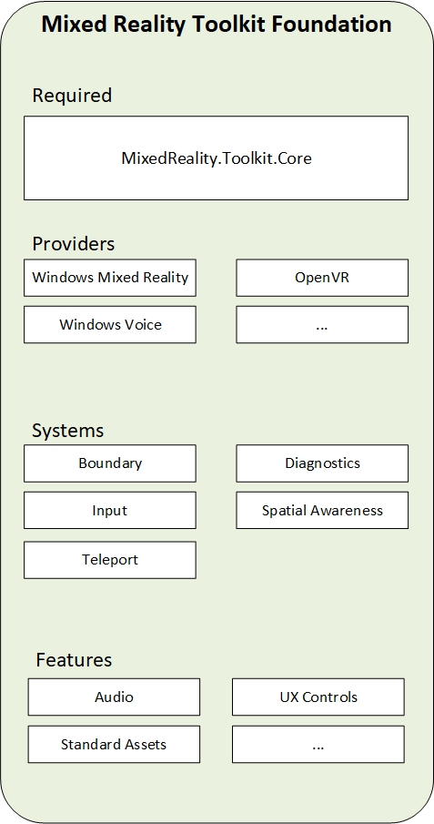
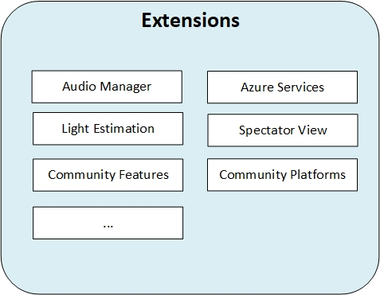
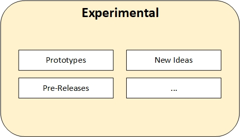

# Mixed Reality Toolkit Packages

The Mixed Reality Toolkit (MRTK) is a collection of packages that enable cross platform Mixed Reality application development by providing support for Mixed Reality hardware and platforms in a componentized manner.

There are three categories of MRTK packages: 

- [Foundation](#foundation-packages)
- [Extension](#extension-packages)
- [Experimental](#experimental-packages)

## Foundation Packages

The Mixed Reality Toolkit Foundation is the set of packages that enable your application to leverage common functionality across Mixed Reality Platforms. These packages are released and supported by Microsoft from source code in the [mrtk_release](https://github.com/Microsoft/MixedRealityToolkit-Unity/tree/mrtk_release) branch on GitHub.

The MRTK Foundation is comprised of:

- [Core Package](#core-package)
- [Platform Providers](#platform-providers)
- [System Services](#system-services)
- [Feature Assets](#feature-assets)

The following sections describe the types of packages in each category.

### Core Package

The core package is a _required_ component and is taken as a dependency by all MRTK foundation packages.

The MRTK Core package includes:

- [Common interfaces, classes and data types](#common-types)
- [MixedRealityToolkit scene component](#mixedrealitytoolkit-scene-component)
- [MRTK Standard Shader](#mrtk-standard-shader)
- [Unity Input Provider](#unity-input-provider)
- [Package Management](#package-management)

#### Common types

The Mixed Reality Toolkit Core package contains the definitions for all of the common interfaces, classes and data types that are used by all other components. It is highly recommended that applications access MRTK components exclusively through the defined interfaces to enable the highest level of compatibility across platforms.

#### MixedRealityToolkit scene component

The MixedRealityToolkit scene component is the single, centralized resource manager for the Mixed Reality Toolkit. This component loads and manages the lifespan of the platform and service modules and provides resources for the systems to access their configuration settings. 

#### MRTK Standard Shader

The MRTK Standard Shader provides the basis for virtually all of the materials provided by the MRTK. This shader is extremely flexible and optimized for the variety of platforms on which MRTK is supported. It is _highly_ recommended that your application's materials use the MRTK standard shader for optimal performance.

#### Unity Input Provider

The Unity Input Provider provides access to common input devices such as game controllers, touch screens and a 3D spatial mouse.

#### Package Management

_Coming soon_

The Mixed Reality Toolkit Core package provides support for discovering and managing the optional foundation, extension and experimental MRTK packages.

### Platform Providers

The MRTK Platform Provider packages are the components that enable the Mixed Reality Toolkit to target Mixed Reality hardware and platform functionality.

Supported platforms include:

- [Windows Mixed Reality](#windows-mixed-reality)
- [OpenVR](#openvr)
- [Windows Voice](#windows-voice)

#### Windows Mixed Reality

The Windows Mixed Reality package provides support for Microsoft HoloLens, HoloLens 2 and Windows Mixed Reality Immersive devices. The package contains full platform support, including:

- Articulated Hands
- Eye Tracking
- Gaze targeting
- Gestures
- Spatial Mapping
- Windows Mixed Reality Motion controllers

#### OpenVR

The OpenVR package provides hardware and platform support for devices using the OpenVR platform.

#### Windows Voice

The Windows Voice package provides support for keyword recognition and dictation functionality on Microsoft Windows 10 devices.

### System Services

Core platform services are provided in system service packages. These packages contain the Mixed Reality Toolkit's default implementations of the system service interfaces, defined in the [core](#core-package) package.

The MRTK foundation includes the following system services:

- [Boundary System](#boundary-system)
- [Diagnostic System](#diagnostic-system)
- [Input System](#input-system)
- [Spatial Awareness System](#spatial-awareness-system)
- [Teleport System](#teleport-system)

#### Boundary System

The MRTK Boundary System provides data about the to virtual reality playspace. On systems for which the user has configured the boundary, the system can provide a floor plane, rectangular playspace, tracked area, and more.

#### Diagnostic System

The MRTK Diagnostic System provides real-time performance data within your application experience. At a glace, you will be able to view frame rate, processor time and other key performance metrics as you use your application.

#### Input System

The MRTK Input Systems enables applications to access input in a cross platform manner by specifying user actions and assigning those actions to the most appropriate buttons and axes on target controllers.

#### Spatial Awareness System

The MRTK Spatial Awareness System enables access to real-world environmental data from devices such as the Microsoft HoloLens.

#### Teleport System

The MRTK Teleport System provides virtual reality locomotion support.

### Feature Assets

Feature Assets are collections of related functionality delivered as Unity assets and scripts. Some of these features include:

- User Interface Controls
- Standard Assets
- more

## Extension Packages

MRTK Extension packages are a collection of packages written by Microsoft and the Community that extend and enhance the functionality of the Mixed Reality Toolkit. Extension authors will state any required dependencies, mark the package as compatible with the Mixed Reality Toolkit and provide licensing and support statements.

Extension packages may provide new features and new platform support. Over time, extensions may, with the assistance and approval of the authors, be migrated into the MRTK Foundation at which time they will be released and supported by Microsoft.

## Experimental Packages

Experimental packages provide the ability to flight prototype features, pre-releases and exciting new ideas. The goal of most experimental packages is to try something new and to gauge customer interest. Many, though not all, experimental packages will be re-released as extensions once the prototyping and testing phase completes.

## Conclusion

The Mixed Reality Toolkit packages and package management system are designed to enable a clean and simple method for you to additively build features into your experiences without requiring unnecessary components to be included into the project.

## See also

- [Downloading MRTK](../DownloadingTheMRTK.md)
- [Getting Started](../GettingStartedWithTheMRTK.md)